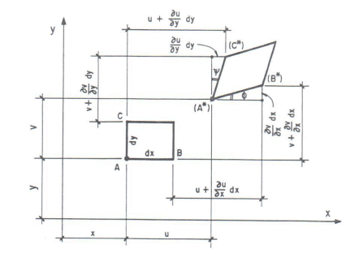

<!--Don't delete this script-->

<!--Don't delete this script-->

<h1>Generalização do Conceito de Deformação</h1>

 
    Nas seções anteriores fizemos a extensão do conceito de tensões e agora o mesmo ponto de vista será aplicado ao conceito de deformações. Observando a Figura <a href="#fig1">1</a> são obtidas as expressões de deformação.

<b>Figura 1.</b> Vista do plano xy de um sólido deformável sujeito a um campo de deslocamento.

<table style="width:100%">
    <tr>
        <td style="width: 90%;">\[\varepsilon_x = \frac{\partial u}{\partial x}\]</td>
        <td style="width: 10%;">
(1)
</td>
    </tr>
    <tr>
        <td style="width: 90%;">\[\varepsilon_y = \frac{\partial v}{\partial y}\]</td>
        <td style="width: 10%;">
(2)
</td>
    </tr>
    <tr>
        <td style="width: 90%;">\[\varepsilon_z = \frac{\partial w}{\partial z}\]</td>
        <td style="width: 10%;">
(3)
</td>
    </tr>
    <tr>
        <td style="width: 90%;">\[\gamma_{xy} = \frac{\partial u}{\partial y} + \frac{\partial v}{\partial x}\]</td>
        <td style="width: 10%;">
(4)
</td>
    </tr>
    <tr>
        <td style="width: 90%;">\[\gamma_{xz} = \frac{\partial u}{\partial z} + \frac{\partial w}{\partial x}\]</td>
        <td style="width: 10%;">
(5)
</td>
    </tr>
    <tr>
        <td style="width: 90%;">\[\gamma_{yz} = \frac{\partial v}{\partial z} + \frac{\partial w}{\partial y}\]</td>
        <td style="width: 10%;">
(6)
</td>
    </tr>
</table>

<h1>Referências</h1>

<table>
    <thead>
        <tr>
            <th>ID</th>
            <th>Referência</th>
        </tr>
    </thead>
    <tbody>
        <tr>
            <td>
[1]
</td>
            <td>
Parnes R. Solid mechanics in engineering. Chichester: Wiley; 2001.
</td>
        </tr>
    </tbody>
</table>
