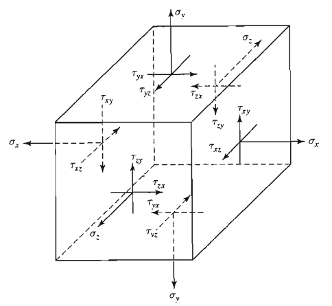

<!--Don't delete this script-->

<!--Don't delete this script-->

    Tal como a análise de tensões, num ponto de um sólido em estado de defomrações existem três direçõesortogonais (direções principais) em relação às quais a distorção é nula (ou seja, os segmentos elementares nestas direções permanecem perpendiculares após a deformação). As deformações destas direção são dadas por \( \epsilon _1, \epsilon _2 e \epsilon _3\). A equação <a href="#eq1">(1)</a>, caracterizada por ser uma equação algébrica do terceiro grau, possui três raízes que caracterizam as deformações principais. 

{: .warning-title }
> IMPORTANTE
>
> O tensor de tensões é simétrico, ou seja, $$\sigma _{ij}=\sigma _{ji}$$, e dessa maneira podemos definir o estado plano de tensões em um ponto somente com seis componentes de tensão.

<table style = "width:100%">
<table style="width:100%">
    <tr>
        <td style="width: 90%;">\[ \varepsilon_o^3 - J_1 \varepsilon_o^2 + J_2 \varepsilon_o - J_3 = 0 \]</td>
        <td style="width: 10%;">
(2.10)
</td>
    </tr>
    <tr>
        <td style="width: 90%;">\[ J_1 = \varepsilon_x + \varepsilon_y + \varepsilon_z \]</td>
        <td style="width: 10%;">
(2.11)
</td>
    </tr>
    <tr>
        <td style="width: 90%;">
        \[
        J_2 = 
        \begin{vmatrix}
        \varepsilon_x & \gamma_{xy} & \gamma_{xz} \\
        \gamma_{xy} & \varepsilon_y & \gamma_{yz} \\
        \gamma_{xz} & \gamma_{yz} & \varepsilon_z 
        \end{vmatrix}
        \]
        </td>
        <td style="width: 10%;">
(2.11)
</td>
    </tr>
    <tr>
        <td style="width: 90%;">
        \[
        J_3 = 
        \begin{vmatrix}
        \varepsilon_x & \gamma_{xy} & \gamma_{xz} \\
        \gamma_{xy} & \varepsilon_y & \gamma_{yz} \\
        \gamma_{xz} & \gamma_{yz} & \varepsilon_z
        \end{vmatrix}
        \]
        </td>
        <td style="width: 10%;">
(2.11)
</td>
   </tr>
</table>

{: .warning-title }
> IMPORTANTE
>
> Considerando o formato em que representamos as nove componentes de tensões, o primeiro subscrito identifica a linha e o segundo subscrito denota a coluna do tensor de tensões de segunda ordem. Por sua vez, a diagonal do tensor de tensões armazena as tensões normais atuantes no ponto ou na partícula. 

<b>Figura 1.</b> Representação gráfica do tensor de tensões <a href="#ref1">[1]</a>.

{: .highlight-title }
> CONCEITO
>
> Um tensor é uma generalização de vetores e matrizes para dimensões superiores. Ele é uma entidade matemática que pode representar relações lineares entre vetores, escalando e rotacionando-os de acordo com uma certa transformação.

Pode ser difícil visualizar diretamente um tensor de ordem superior, mas pense neles como extensões de vetores e matrizes para várias dimensões. Eles encapsulam informações mais complexas, especialmente em sistemas que requerem múltiplas direções de análise ao mesmo tempo.

<h1>Referências</h1>

<table>
    <thead>
        <tr>
            <th>ID</th>
            <th>Referência</th>
        </tr>
    </thead>
    <tbody>
        <tr>
            <td>
[1]
</td>
            <td>
Parnes R. Solid mechanics in engineering. Chichester: Wiley; 2001.
</td>
        </tr>    
    </tbody>
</table>
