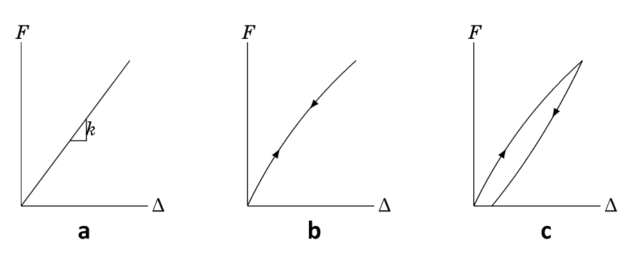

<!--Don't delete this script-->

<!--Don't delete this script-->

 
    Nesta seção os conceitos de tensão e deformação são aplicados para construção e interpretação de problemas físicos. Neste âmbito o material pode ter três comprotamentos básicos conforme descrito na Figura <a href="#fig-hooke-1">1</a>.

<b>Figura 1.</b> Comportamentos de uma mola ideal: (a) Elástico linear; (b) Elástico Não - Linear; (c) Inelástico.

 
    A lei de Hooke para o caso unidimensional pode ser escrita conforme a equação <a href="#eq1">(1)</a>.

<table style="width:100%">
    <tr>
        <td style="width: 90%;">\[\sigma = E \cdot \varepsilon \]</td>
        <td style="width: 10%;">
(1)
</td>
    </tr>
</table>

<h1>Referências</h1>

<table>
    <thead>
        <tr>
            <th>ID</th>
            <th>Referência</th>
        </tr>
    </thead>
    <tbody>
        <tr>
            <td>
[1]
</td>
            <td>
Parnes R. Solid mechanics in engineering. Chichester: Wiley; 2001.
</td>
        </tr>
    </tbody>
</table>
