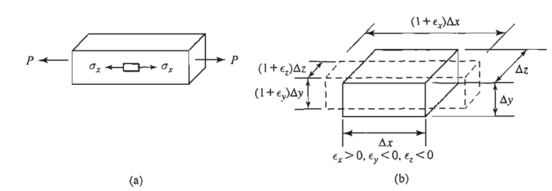

<!--Don't delete this script-->

<!--Don't delete this script-->

<h1>Isotropia</h1>

    A isotropia é definida como uma propriedade física do material que indica que as características do material não variam conforme a direção. A propriedade inversa é a anisotropia onde o valor das propriedades variam conforme a direção. 

{: .highlight-title }
> CONCEITO
>
> Exitem casos particulares desses estados gerais e no caso da anisotropia um estado particular é a ortotropia onde as propriedades físicas são iguais em um plano e variam em uma direão ortogonal a esse plano. Um exemplo clássico desse tipo de material é a madeira.

<h1>Coeficiente de Poisson</h1>

    Quando um material é alongado ou comprimido em uma direção (ao longo do eixo longitudinal), ele tende a contrair ou expandir em direções perpendiculares à força aplicada. O coeficiente de Poisson quantifica essa relação entre as deformações:

<table style="width:100%">
    <tr>
        <td style="width: 90%;">\[ \nu = -\frac{\varepsilin_{lat}}{\varepsilin_{long}} \]</td>
        <td style="width: 10%;">
(1)
</td>
    </tr>
</table>

    Onde \(\varepsilin_{lat}\) é a deformação lateral do sólido e \(\varepsilin_{long}\) é a deformação longitudinal.

    Vamos agora escrever o efeito de Poisson nas deformações de um sólido tridimensional conforme descrito na Figura <a href="#fig-hookegen-1">1</a>.

<b>Figura 1.</b> Visualização gráfica do conceito de Poisson.

<table style="width:100%">
    <tr>
        <td style="width: 90%;">\[ \varepsilon_x = \frac{\sigma_x}{E} \]</td>
        <td style="width: 10%;">
(2)
</td>
    </tr>
    <tr>
        <td style="width: 90%;">\[ \varepsilon_y = - \nu \frac{\sigma_x}{E} \]</td>
        <td style="width: 10%;">
(3)
</td>
    </tr>
    <tr>
        <td style="width: 90%;">\[ \varepsilon_z = - \nu \frac{\sigma_x}{E} \]</td>
        <td style="width: 10%;">
(4)
</td>
    </tr>
</table>

    Consideração a superposição dos efeitos e um estado tridimensionais de tensões, chega-se as equações de deformações completas:

<table style="width:100%">
    <tr>
        <td style="width: 90%;">\[ \varepsilon_x = \frac{1}{E} \left( \sigma_x - \nu \sigma_y - \nu \sigma_z \right) \]</td>
        <td style="width: 10%;">
(5)
</td>
    </tr>
    <tr>
        <td style="width: 90%;">\[ \varepsilon_y = \frac{1}{E} \left( \sigma_y - \nu \sigma_z - \nu \sigma_x \right) \]</td>
        <td style="width: 10%;">
(6)
</td>
    </tr>
    <tr>
        <td style="width: 90%;">\[ \varepsilon_z = \frac{1}{E} \left( \sigma_z - \nu \sigma_x - \nu \sigma_y \right) \]</td>
        <td style="width: 10%;">
(7)
</td>
    </tr>
    <tr>
        <td style="width: 90%;">\[ \gamma_{xy} = \frac{1}{G} \tau_{xy} \]</td>
        <td style="width: 10%;">
(8)
</td>
    </tr>
    <tr>
        <td style="width: 90%;">\[ \gamma_{yz} = \frac{1}{G} \tau_{yz} \]</td>
        <td style="width: 10%;">
(9)
</td>
    </tr>
    <tr>
        <td style="width: 90%;">\[ \gamma_{zx} = \frac{1}{G} \tau_{zx} \]</td>
        <td style="width: 10%;">
(10)
</td>
    </tr>
</table>

<h1>Referências</h1>

<table>
    <thead>
        <tr>
            <th>ID</th>
            <th>Referência</th>
        </tr>
    </thead>
    <tbody>
        <tr>
            <td>
[1]
</td>
            <td>
Parnes R. Solid mechanics in engineering. Chichester: Wiley; 2001.
</td>
        </tr>    
    </tbody>
</table>
