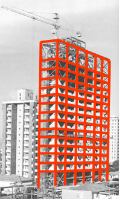

    Está seção pretende revisar conceitos importantes da graduação como os de esforços, tensões e deformações. Com isso poderemos estender os conceitos dessas grandezas para formulações mais completas que contemplam as três dimensões por exemplo. 
      
    De uma forma geral aqui nessa disciplina estamos preocupados em fornencer conceitos do comportamento de um sólido de geometria genérica. Essa base permitirá modelarmos elementos tradicionais na engenharia como vigas, pilares, eixos, vasos de pressão e dutos por exemplo.
      
    No contexto da engenharia civil o estudo na mecânica dos sólidos está intrinsecamente ligado ao projeto dos elementos estruturais que devem ser resistentes, estáveis, duráveis e robustas. 

<table>
  <tr>
    <td style="width:70%;">
      

        A estrutura é responsável por transmitir os esforços até as suas fundações. Essa transmissão deverá ocorrer de maneira adequada, respeitando os critérios de estados limites impostos pelas normativas de projeto e sempre que possível com uso mínimo de recursos. 
          
        Nesta imagem podemos ver a marcação dos elementos estruturais de vigas e pilares que formam um edifício de múltiplos pavimentos em concreto armado.
      

    </td>
    <td style="width:30%; text-align: center;"></td>  
  </tr>
</table>

    Prof. Rosa <a href="#ref1">[1]</a> afirma que são variáveis de um projeto estrutural:

<ul>
    <li>Valores nominais de carga, como forças, momentos e pressão;</li>
    <li>Valores máximos de carregamento;</li>
    <li>Variação de temperatura durante a operação;</li>
    <li>Propriedades dos materiais usados;</li>
    <li>Tipos de vínculos e restrições;</li>
    <li>Nível de segurança.</li>
</ul>

    Como dito anteriormente estaremos preocupados nessa disciplina em verificar o comportamento de um material de geometria genérica sob ação de carregamentos em diversas direções.
      
    Em seguida recordaremos alguns aspectos da análise de estruturas.

<h1>Referências</h1>

<table>
    <thead>
        <tr>
            <th>ID</th>
            <th>Reference</th>
        </tr>
    </thead>
    <tbody>
        <tr>
            <td>
[1]
</td>
            <td>
<a href="https://doi.org/10.1007/s00521-016-2328-2" target="_blank" rel="noopener noreferrer">Rosa E. Análise de resistência mecânica: Mecânica da fratura e fadiga. UFSC; 2002.</a>
</td>
        </tr>
    </tbody>
</table>