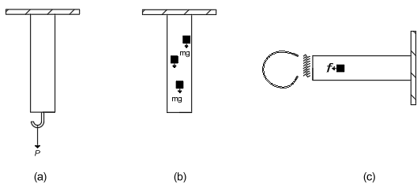

<!--Don't delete this script-->

<!--Don't delete this script-->

<h1>Introdução</h1>

    Um corpo, para efeitos da mecânica, é uma porção de matéria que, num determinado momento,
    momento no tempo, ocupa uma determinada região do espaço. Se a região ocupada por
    o corpo pode ser idealizado como sendo de extensão insignificante (e, portanto, redutível a um
    ponto), o corpo é chamado de partícula. Qualquer corpo que não seja redutível a um único
    partícula será chamada de contínuo <a href="#ref1">[1]</a>.
      
    Süssekind <a href="#ref2">[2]</a> afirma que existem duas grandezas fundamentais: forças e momentos. Porém para que começemos a analisar os sólidos deformáveis vamos partir da premissa básica de que exista um certo equilíbrio. Logo para que um corpo esteja em uma condição de equilíbrio é necessário que esse sistema de forças não provoque nenhuma tendência de translação e rotação a um corpo. Portanto podemos escrever as equações <a href="#eq1">(1)</a> e <a href="#eq2">(2)</a>:

<table style = "width:100%">
    <tr>
        <td style="width: 90%;">\[ \sum \vec F = 0 \]</td>
        <td style="width: 10%;">
(1)
</td>
    </tr>
    <tr>
        <td style="width: 90%;">\[\sum\vec M=\sum\left(\vec r\times\vec F\right)=0\]</td>
        <td style="width: 10%;">
(2)
</td>
    </tr>
</table>

    Cada um desses vetores pode ser decomposto nas componentes cartesianas \(x\), \(y\) e \(z\). Tal situação permite verificar o equilíbrio em cada uma das direções.

{: .highlight-title }
> CONCEITO
>
> Força é uma grandeza física vetorial que pode modificar a direção, o sentido e a velocidade dos corpos. Salientamos que uma força é uma grandeza vetorial.  
> Já o momento é a grandeza que mede a tendência de rotação em torno de um ponto provocada por uma força.

    Em geral as forças são divididas em dois grandes grupos: 

<ul>
    <li>Forças de superfície (Ver Figura <a href="#fig-intro-1">1a</a>)</li>
    <li>Forças de corpo (Ver Figura <a href="#fig-intro-1">1b</a> e <a href="#fig-intro-1">1c</a>)</li>
</ul>

    Na Figura <a href="#fig-intro-1">1a</a> podemos verificar uma força de superfície agindo. Considerando que este elemento está tracionado poderiamos dizer que a força \( \vec{P} \) representa a massa de um corpo que é suportado pelo tirante. Já as Figuras <a href="#fig-intro-1">1b</a> e <a href="#fig-intro-1">1c</a> representam as forças de corpo sendo que em <a href="#fig-intro-1">1b</a> seria o próprio peso do elemento estrutural sujeito a ação da gravidade e <a href="#fig-intro-1">1c</a> a ação de uma força magnética de um imã.

<b>Figura 1.</b> Exemplos de forças de corpo e superfície <a href="#ref3">[3]</a>.

    Em termos de representação as forças podem ser:

<ul>
    <li>Forças concentradas</li>
    <li>Forças distribuídas</li>
</ul>

    Para introduzir o conceito de tensão em uma forma mais ampla precisamos determinar os esforços internos que ocorrem no interior de um sólido. Para isso vejamos o conjunto barra-cabo da Figura <a href="#fig-intro-2">2</a>.  

<b>Figura 2.</b> Conjunto barra-cabo submetido a uma força de 18 kN <a href="#ref3">[3]</a>.

    Dado que um sistema de forças, atuando sobre um corpo, encontra equilíbrio através das reações de apoio que ele provoca <a href="#ref2">[2]</a> poderiamos nos fazer a seguinte pergunta: O que ocorre no interior deste corpo?
       
    Para responder essa pergunta precisamos cortar uma seção <i>S</i> em um sólido de geometria hipótetica conforme descrito na Figura <a href="#fig-intro-3">3</a>. O que encontrariamos nas suas seções?

<b>Figura 3.</b> Corpo deformável cortado por uma seção <i>S</i> <a href="#ref4">[4]</a>.

    Para ser possível a divisão entre as partes, preservando o equilíbrio das mesmas, é necessário que apliquemos a seção <i>SE</i>, por exemplo, um sistema estático equivalente \( \left( \vec{M} \; \text{e} \; \vec{R} \right) \) aos das forças atuantes na parte <i>SD</i>. Isto vale de maneira analoga para parcela da direita <a href="#ref2">[2]</a>. Logo podemos visualizar essas seções <i>SE</i> e <i>SD</i> separadamente conforme Figura <a href="#fig-intro-4">4</a>.

<b>Figura 4.</b> Seções <i>SE</i> e <i>SD</i> de um sólido deformável <a href="#ref2">[2]</a>.

{: .highlight-title }
> CONCEITO
>
> Portanto os esforços internos são forças e momentos que resultam da ação de forças externas sobre um sólido deformável qualquer e são responsáveis por manter o equilíbrio entre as porções deste sólido. Logo estes esforços internos podem ser decompostos em outros vetores de forças e momentos dando origem a forças normais, de cisalhamento, momentos fletores, etc.

<h1>Referências</h1>

<table>
    <thead>
        <tr>
            <th>ID</th>
            <th>Referência</th>
        </tr>
    </thead>
    <tbody>
        <tr>
            <td>
[1]
</td>
            <td>
<a href="https://doi.org/10.1007/978-3-319-18878-2" target="_blank" rel="noopener noreferrer">Lubliner J, Papadopoulos P. Introduction to Solid Mechanics: An Integrated Approach. Cham: Springer International Publishing; 2017.</a>
</td>
        </tr>
        <tr>
            <td>
[2]
</td>
            <td>
Süssekind JC. Curso de análise estrutural: estruturas isostáticas. vol. 1, 11. ed. São Paulo: Globo, 1991. 3v. ISBN 852502267.
</td>
        </tr>
        <tr>
            <td>
[3]
</td>
            <td>
Parnes R. Solid mechanics in engineering. Chichester: Wiley; 2001.
</td>
        </tr>
        <tr>
            <td>
[4]
</td>
            <td>
Vilaça SF, Taborda LF. Introducao à Teoria da Elasticidade. Rio de Janeiro: COPPE - UFRJ; 1998.
</td>
        </tr>
        <tr>
            <td>
[5]
</td>
            <td>
Shames IH, Pitarresi JM. Introduction to solid mechanics. 3rd ed. Upper Saddle River, NJ: Prentice Hall; 2000.
</td>
        </tr>
    </tbody>
</table>

