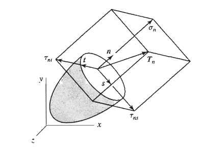

<!--Don't delete this script-->

<!--Don't delete this script-->

<h1>Conceito de Tensão</h1>

  Dado que conhecemos os esforços em um seção qualquer do sólido podemos nos por a pensar sobre o efeito dessa força em toda a área dessa seção <i>S</i>. Tal fato poderia nos permitir a determinar a capacidade de carga daquela área genérica. Isso nos leva ao conceito mais básico de tensão que corresponde a uma intensidade médida das forças em uma área <i>A</i> qualquer. Chamaremos essa intensidade de forças por unidade de área de tensão \( \left( \sigma \right) \). Um exemplo dessa distribuição pode ser visto na Figura <a href="#fig-tensao-1">1</a> e a equação <a href="#eq1">(1)</a> define essa tensão.

<b>Figura 1.</b> Força \( \vec{P} \) atuando em um corpo livre do tipo barra reta <a href="#ref1">[1]</a>.

<table style = "width:100%">
    <tr>
        <td style="width: 90%;">\[  \sigma = \frac{dF}{dA} \]</td>
        <td style="width: 10%;">
(1)
</td>
    </tr>
</table>

  Onde \( dF \) e \( dA \) correspondem a uma força e área infinitesimal respectivamente. 

  Em condições mais complexas de carregamento essas tensões poderiam ser decompostas nas outras dimensões do espaço, porém isso será abordado na sequência do material para que assim possamos generalizar o conceito de tensão e então empregar uma formulação tensorial.

<h3>Alguns tipos de tensão</h3>

  O conceito abordado anteriormente foi o conceito unidimensional de tensão. Porém recuperando um pouco dos problemas desenvolvidos na resitência dos materiais temos diferentes tipos de tensões, como a de flexão e de cisalhamento por exemplo. Podemos até escrever formalmente cada uma dessas equações conforme descrito em <a href="#eq2">(2)</a> e <a href="#eq3">(3)</a>:     

<table style = "width:100%">
    <tr>
        <td style="width: 90%;">\[  \sigma = \frac{M \cdot y }{I} \]</td>
        <td style="width: 10%;">
(2)
</td>
    </tr>
</table>

  Onde \( M \) corresponde ao momento fletor atuante na seção transversal, \( y \) a posição da linha neutra e \(I\) o momento de inércia em torno do eixo neutro que ocorre a flexão estudada.

<table style = "width:100%">
    <tr>
        <td style="width: 90%;">\[  \tal = \frac{V \cdot Q}{I \cdot b} \]</td>
        <td style="width: 10%;">
(3)
</td>
    </tr>
</table>

  Onde \( V \) corresponde ao cisalhamento atuante na seção transversal, \( Q \) é o momento estático da área de referência, \(I\) o momento de inércia em torno do eixo que ocorre a flexão e \(b\) a espessura do elemento.

<h1>Conceito de Deformação</h1>

  O segundo conceito a ser abordado nesta seção é o de deformação. Este consiste na variação de formas e dimensões de um sólido passando para uma nova configuração conforme <a href="#fig-tensao-2">2</a>. Nesta Figura é possível ver um ponto material do sólido mudando sua posição de <i>A</i> para <i>A*</i>.

<b>Figura 2.</b> Efeito de um campo <i>u</i> de deslocamento sobre um sólido deformável <a href="#ref1">[1]</a>.

{: .warning-title }
> IMPORTANTE
>
> Um campo de deslocamento pode ser decomposto em duas parcelas, uma delas representando o movimento de corpo rígido, o qual não envolve mudança de forma e dimensões do corpo, e a outra traduzindo justamente este efeito.

  Portanto considerando um elemento unidimensional de comprimento inicial <i>L</i> podemos definir a deformação na sua forma infinitesimal:

<b>Figura 3.</b> Efeito do campo de deslocamento <i>u</i> em uma barra de comprimento <i>L</i> <a href="#ref3">[3]</a>.

<table style = "width:100%">
    <tr>
        <td style="width: 90%;">\[  \varepsilon  = \frac{du(x)}{dx} \]</td>
        <td style="width: 10%;">
(2)
</td>
    </tr>
</table>

  O segundo conceito a ser abordado nesta seção é o de deformação. Este consiste na variação de formas e dimensões de um sólido passando para uma nova configuração conforme <a href="#fig-tensao-2">2</a>. Nesta Figura é possível ver um ponto material do sólido mudando sua posição de <i>A</i> para <i>A*</i>.

<h1>Carregamentos multiaxiais</h1>

  Em geral o que foi empregado em resistência dos materiais é destinado a uma análise em duas dimensões onde por exemplo poderiamos construir uma viga e determinar os esforços naquele plano. No mundo "real" a avaliação das tensões e deformações de um corpo deformável está suijeita a constribuições nas três dimensões do espaço. Logo para estudar sólidos nesse nível de detalhamento é preciso entender os carregamentos multiaxiais.

<h1>Referências</h1>

<table>
    <thead>
        <tr>
            <th>ID</th>
            <th>Referência</th>
        </tr>
    </thead>
    <tbody>
        <tr>
            <td>
[1]
</td>
            <td>

            Beer FP, Johnston Jr. ER, DeWolf JT, Mazurek DF. Mecânica dos materiais. 5o. McGraw-Hill e Bookman; 2021.
</td>
        </tr>
        <tr>
            <td>
[2]
</td>
            <td>
Vilaça SF, Taborda LF. Introducao à Teoria da Elasticidade. Rio de Janeiro: COPPE - UFRJ; 1998.
</td>
        </tr>
        <tr>
            <td>
[3]
</td>
            <td>
Parnes R. Solid mechanics in engineering. Chichester: Wiley; 2001.
</td>
        </tr>
    </tbody>
</table>