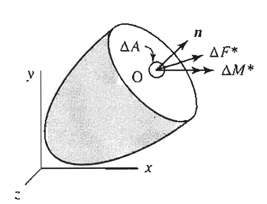

<!--Don't delete this script-->

<!--Don't delete this script-->

<h1>Generalização do Conceito de Tensão</h1>

 
    Consideremos um sólido seccionado na seção <i>S</i> sujeito a um sistema de forças conforme descrito na Figura <a href="#fig-tensao-1">1</a>. Consideremos que uma parcela infinitesimal \(d\mathbf{F}^*\) e \(d\mathbf{M}^*\) atuem em uma área \(dA\) que possui um vetor normal  \( \vec{\mathbf{n}} \). Dada que a relação \(d\mathbf{M}^*/dA → 0\) podemos escrever a equação <a href="#eq1">(1)</a> que define a tensão nesse ponto O.

<b>Figura 1.</b> Seção esquerda de um sólido onde atuam as grandezas infinitesimais \(d\mathbf{F}^*\) e \(d\mathbf{M}^*\) <a href="#ref1">[1]</a>.

<table style = "width:100%">
    <tr>
        <td style="width: 90%;">\[ \mathbf{T}_n = \frac{d\mathbf{F}^*}{dA} \]</td>
        <td style="width: 10%;">
(1)
</td>
    </tr>
</table>

{: .highlight-title }
> CONCEITO
>
> $$\mathbf{T}_n$$ é definido em muitas literaturas como o vetor **tração** e por definição representa a intensidade de uma força por unidade de área que atua em uma direção arbitrária em relação ao plano de vetor normal $$\vec{\mathbf{n}}$$.

    A força \(\mathbf{T}_n\) poderá ser decomposta nas nas direções nos eixos globais \(x\), \(y\) e \(z\) que será indicada respectivamente pelos vetores diretores \(\mathbf{\hat{i}}\), \(\mathbf{\hat{j}}\) e \(\mathbf{\hat{k}}\). Logo o vetor tração na sua forma geral decomposta poderá ser escrito conforme a equação <a href="#eq2">(2)</a>. A Figura <a href="#fig-tensao-2">2</a> apresenta a intensidade de força por unidade de área de acordo com os eixos diretores diretores \(\mathbf{\hat{n}}\), \(\mathbf{\hat{s}}\) e \(\mathbf{\hat{t}}\) 

<table style = "width:100%">
    <tr>
        <td style="width: 90%;">\[ \mathbf{T}_n = \sigma _{nn} \, \mathbf{\hat{n}} + \tau _{ns} \, \mathbf{\hat{s}} + \tau _{nt} \, \mathbf{\hat{t}}\]</td>
        <td style="width: 10%;">
(1)
</td>
    </tr>
</table>

<b>Figura 2.</b> Decomposição do vetor tração nas coordenadas \(\mathbf{\hat{n}}\), \(\mathbf{\hat{s}}\) e \(\mathbf{\hat{t}}\) <a href="#ref1">[1]</a>.

<h1>Referências</h1>

<table>
    <thead>
        <tr>
            <th>ID</th>
            <th>Referência</th>
        </tr>
    </thead>
    <tbody>
        <tr>
            <td>
[1]
</td>
            <td>
Parnes R. Solid mechanics in engineering. Chichester: Wiley; 2001.
</td>
        </tr>
        <tr>
            <td>
[3]
</td>
            <td>
<a href="https://doi.org/10.1007/978-3-319-18878-2" target="_blank" rel="noopener noreferrer">Lubliner J, Papadopoulos P. Introduction to Solid Mechanics: An Integrated Approach. Cham: Springer International Publishing; 2017.</a>
</td>
        </tr>
        <tr>
            <td>
[2]
</td>
            <td>
Süssekind JC. Curso de análise estrutural: estruturas isostáticas. vol. 1, 11. ed. São Paulo: Globo, 1991. 3v. ISBN 852502267.
</td>
        </tr>
        <tr>
            <td>
[4]
</td>
            <td>
Vilaça SF, Taborda LF. Introducao à Teoria da Elasticidade. Rio de Janeiro: COPPE - UFRJ; 1998.
</td>
        </tr>
        <tr>
            <td>
[5]
</td>
            <td>
Shames IH, Pitarresi JM. Introduction to solid mechanics. 3rd ed. Upper Saddle River, NJ: Prentice Hall; 2000.
</td>
        </tr>
    </tbody>
</table>

