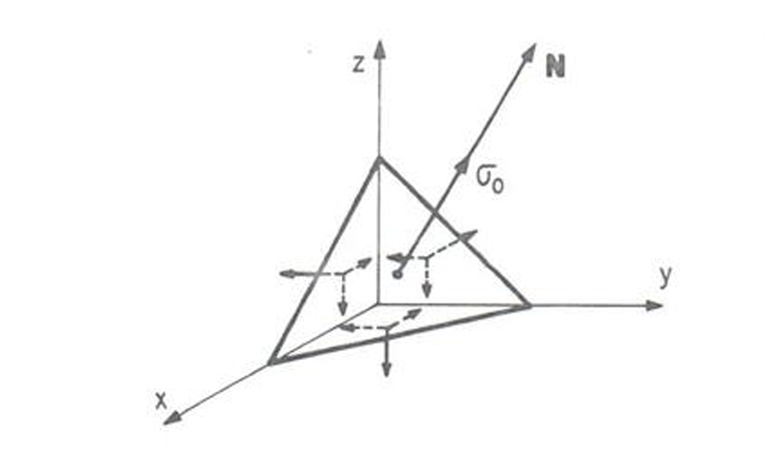

<!--Don't delete this script-->

<!--Don't delete this script-->

<h1>Introdução</h1>

    Consideremos um tetraedro com uma face inclinada onde \(\vec{n}\) indica uma direção principal e \(\sigma_0\) a tensão principal que nela atua. As tensões podem ser escritas em termos dos eixos coordenados conforme equações <a href="#eq1">(1)</a> a <a href="#eq3">(3)</a>.

<b>Figura 1.</b> Sólido tetraédrico com direção normal \(\vec{n}\).

<table style = "width:100%">
    <tr>
        <td style="width: 90%;">\[ \mathbf{\rho}_x = \sigma _{xx} \, \mathbf{\hat{i}} + \tau _{xy} \, \mathbf{\hat{j}} + \tau _{xz} \, \mathbf{\hat{k}}\]</td>
        <td style="width: 10%;">
(1)
</td>
    </tr>
    <tr>
        <td style="width: 90%;">\[ \mathbf{\rho}_y = \tau _{xy} \, \mathbf{\hat{i}} + \sigma _{yy} \, \mathbf{\hat{j}} + \tau _{yz} \, \mathbf{\hat{k}}\]</td>
        <td style="width: 10%;">
(2)
</td>
    </tr>
    <tr>
        <td style="width: 90%;">\[ \mathbf{\rho}_z = \tau _{xz} \, \mathbf{\hat{i}} + \tau _{yz} \, \mathbf{\hat{j}} + \sigma _{zz} \, \mathbf{\hat{k}}\]</td>
        <td style="width: 10%;">
(3)
</td>
    </tr>
</table>

    Escrevendo a tensão \(\sigma_0\) em termos dso eixos coordenados temos:

<table style = "width:100%">
    <tr>
        <td style="width: 90%;">\[ \mathbf{\rho}_x = \sigma _{0} \cdot \cos \alpha = \sigma _{xx} \, \mathbf{\hat{i}}  \]</td>
        <td style="width: 10%;">
(4)
</td>
    </tr>
    <tr>
        <td style="width: 90%;">\[ \mathbf{\rho}_y = \sigma _{0} \cdot \cos \beta = \sigma _{yy} \, \mathbf{\hat{j}}  \]</td>
        <td style="width: 10%;">
(5)
</td>
    </tr>
    <tr>
        <td style="width: 90%;">\[ \mathbf{\rho}_z = \sigma _{0} \cdot \cos \gamma = \sigma _{zz} \, \mathbf{\hat{k}}  \]</td>
        <td style="width: 10%;">
(6)
</td>
    </tr>
</table>

    Combinando as expressões chegamos em:

<table style = "width:100%">
    <tr>
        <td style="width: 90%;">\[ \left(\sigma _{xx} - \sigma _{0}\right)  \, \mathbf{\hat{i}} + \tau _{xy} \, \mathbf{\hat{j}} + \tau _{xz} \, \mathbf{\hat{k}} = 0\]</td>
        <td style="width: 10%;">
(7)
</td>
    </tr>
    <tr>
        <td style="width: 90%;">\[ \tau _{xy} \, \mathbf{\hat{i}} + \left(\sigma _{yy} - \sigma _{0}\right) \, \mathbf{\hat{j}} + \tau _{yz} \, \mathbf{\hat{k}} = 0\]</td>
        <td style="width: 10%;">
(8)
</td>
    </tr>
    <tr>
        <td style="width: 90%;">\[ \tau _{xz} \, \mathbf{\hat{i}} + \tau _{yz} \, \mathbf{\hat{j}} + \left(\sigma _{zz} - \sigma _{0}\right) \, \mathbf{\hat{k}} = 0\]</td>
        <td style="width: 10%;">
(9)
</td>
    </tr>
</table>

    Em termos de tensor:

<table style = "width:100%">
    <tr>
        <td style="width: 90%;">\[ \begin{bmatrix}
                                    \left(\sigma _{xx} - \sigma _{0}\right)&  \tau_{xy} &  \tau_{xz}\\
                                    \tau_{xy}&  \left(\sigma_{yy} - \sigma_{0}\right) &  \tau_{yz}\\
                                    \tau_{xz}&  \tau_{yz}&  \left(\sigma_{zz} - \sigma_{0}\right)\\
                                    \end{bmatrix}  = 0 \]</td>
        <td style="width: 10%;">
(10)
</td>
    </tr>
</table>

    Extraindo o determinante deste tensor chegamos a uma equação do terceiro grau em \(\sigma_0\), cuja as três raízes são as tensões principais \(\sigma_1\), \(\sigma_2\), \(\sigma_3\). Desenvolvendo o determinante chega-se na seguinte expressão algébrica:

<table style = "width:100%">
    <tr>
        <td style="width: 90%;">\[ \sigma_0^3 - I_1 \cdot \sigma_0^2 + I_2 \cdot \sigma_0 - I_3 = 0 \]</td>
        <td style="width: 10%;">
(11)
</td>
    </tr>
    <tr>
        <td style="width: 90%;">\[I_1 = \sigma_{xx} + \sigma_{yy} + \sigma_{zz} \]
        </td>
        <td style="width: 10%;">
(12)
</td>
    </tr>
    <tr>
        <td style="width: 90%;">\[I_2 = \begin{vmatrix}
                                        \sigma_{xx} & \tau_{xy} \\
                                        \tau_{yx} &  \sigma_{yy} \\
                                        \end{vmatrix} + \begin{vmatrix}
                                        \sigma_{xx} & \tau_{xz} \\
                                        \tau_{zx} &  \sigma_{zz} \\
                                        \end{vmatrix} + \begin{vmatrix}
                                        \sigma_{yy} & \tau_{yz} \\
                                        \tau_{yzy} &  \sigma_{zz} \\
                                        \end{vmatrix} \]
        </td>
        <td style="width: 10%;">
(13)
</td>
    </tr>
    <tr>
        <td style="width: 90%;">\[ I_3 = \begin{vmatrix}
                                        \sigma_{xx}&  \tau_{xy}&  \tau_{xz}\\
                                        \tau_{xy}&  \sigma _{yy}&  \tau_{yz}\\
                                        \tau_{xz}&  \tau_{yz}&  \sigma_{zz}\\
                                        \end{vmatrix} \] \]
        </td>
        <td style="width: 10%;">
(14)
</td>
    </tr>
</table>

<h1>Referências</h1>

<table>
    <thead>
        <tr>
            <th>ID</th>
            <th>Referência</th>
        </tr>
    </thead>
    <tbody>
        <tr>
            <td>
[1]
</td>
            <td>
<a href="https://doi.org/10.1007/978-3-319-18878-2" target="_blank" rel="noopener noreferrer">Lubliner J, Papadopoulos P. Introduction to Solid Mechanics: An Integrated Approach. Cham: Springer International Publishing; 2017.</a>
</td>
        </tr>
        <tr>
            <td>
[2]
</td>
            <td>
Süssekind JC. Curso de análise estrutural: estruturas isostáticas. vol. 1, 11. ed. São Paulo: Globo, 1991. 3v. ISBN 852502267.
</td>
        </tr>
        <tr>
            <td>
[3]
</td>
            <td>
Parnes R. Solid mechanics in engineering. Chichester: Wiley; 2001.
</td>
        </tr>
        <tr>
            <td>
[4]
</td>
            <td>
Vilaça SF, Taborda LF. Introducao à Teoria da Elasticidade. Rio de Janeiro: COPPE - UFRJ; 1998.
</td>
        </tr>
        <tr>
            <td>
[5]
</td>
            <td>
Shames IH, Pitarresi JM. Introduction to solid mechanics. 3rd ed. Upper Saddle River, NJ: Prentice Hall; 2000.
</td>
        </tr>
    </tbody>
</table>

