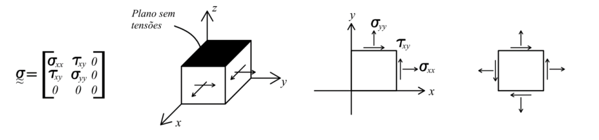

<!--Don't delete this script-->

<!--Don't delete this script-->

<h1>Introdução</h1>

    O estado plano de tensões é dado por uma condição de nulidade de uma das tensões que atuam sobre o sistema. Por exemplo em resistência dos materiais é comum que adotarmos a perspectiva da tensão \(\sigma_{zz}=0\). Isso implica em por exemplo um tensor de tensões no seguinte formato:

<table style = "width:100%">
    <tr>
        <td style="width: 90%;">
                                \[ \begin{bmatrix}
                                    \sigma _{xx} &  \tau_{xy}\\
                                    \tau_{xy}&  \sigma_{yy}
                                    \end{bmatrix} 
                                \]
        </td>
        <td style="width: 10%;">
(1)
</td>
    </tr>
</table>

    A Figura <a href="#fig-ept-1">1</a> apresenta a condição de estado plano de tensão considerando a nulidade de tensões no plano de vetor normal \(k\). 

<b>Figura 1.</b> Estado plano de tensão considerando nulidade de tensões no plano de vetor normal \(k\).

    Manipulando as chegamos as equações de tensão normal e de cisalhamento para qualquer direção no estado plano de tensões.

<table style = "width:100%">
    <tr>
        <td style="width: 90%;">
                                \[ \sigma_n = \frac{\sigma_{xx} + \sigma_{yy}}{2} + \frac{\sigma_{xx} - \sigma_{yy}}{2} \cos 2\alpha + \tau_{xy} \sin 2\alpha \]
        </td>
        <td style="width: 10%;">
(2)
</td>
    </tr>
    <tr>
        <td style="width: 90%;">
                                \[ \tau_t = - \left( \frac{\sigma_{xx} - \sigma_{yy}}{2} \right) \sin 2\alpha + \tau_{xy} \cos 2\alpha
 \]
        </td>
        <td style="width: 10%;">
(3)
</td>
    </tr>
</table>

   É sempre muito importante conheecer os valores que extremizam a função de tensão. Para isso aplicamos o mesmo conceito da seção de tensões e então verificamos o determinante do tensor de tensões para o estado plano. Conforme descrito na equação <a href="#eq4">(4)</a> onde \(\sigma_e\) representa tensão principal a ser determinada.

<table style = "width:100%">
    <tr>
        <td style="width: 90%;">
                                \[ \left| 
                                \begin{matrix}
                                \sigma_{xx} - \sigma_e & \tau_{xy} \\
                                \tau_{xy} & \sigma_{yy} - \sigma_e 
                                \end{matrix} 
                                \right| = 0
                                \]
        </td>
        <td style="width: 10%;">
(4)
</td>
    </tr>
    <tr>
        <td style="width: 90%;">
                                \[ \sigma_e^2 - (\sigma_{xx} + \sigma_{yy})\sigma_e + \sigma_{xx}\sigma_{yy} - \tau_{xy}^2 = 0
 \]
        </td>
        <td style="width: 10%;">
(5)
</td>
    </tr>
</table>

   Com isso chegamos facilmente as conhecidas equações de tensões normais máximas e mínimas atuante.

<table style = "width:100%">
    <tr>
        <td style="width: 90%;">
                                \[ 
                                    \begin{cases}
\sigma_1 = \frac{\sigma_{xx} + \sigma_{yy}}{2} + \sqrt{\left( \frac{\sigma_{xx} - \sigma_{yy}}{2} \right)^2 + \tau_{xy}^2} \\
\sigma_3 = \frac{\sigma_{xx} + \sigma_{yy}}{2} - \sqrt{\left( \frac{\sigma_{xx} - \sigma_{yy}}{2} \right)^2 + \tau_{xy}^2}
\end{cases}
                                \]
        </td>
        <td style="width: 10%;">
(6)
</td>
    </tr>
</table>

   Para chegar a máxima tensão de cisalhamento aplica-se o conceito de derivada em função do ângulo \(\alpha\). Logo fazendo \(\dfrac{d(\sigma_n)}{d\alpha}\)

<table style = "width:100%">
    <tr>
        <td style="width: 90%;">
                                \[ \frac{d\sigma_n}{d\alpha} = 0 \rightarrow -2 \frac{\sigma_{xx} - \sigma_{yy}}{2} \sin 2\alpha + 2\tau_{xy} \cos 2\alpha = 0
                                \]
        </td>
        <td style="width: 10%;">
(7)
</td>
    </tr>
    <tr>
        <td style="width: 90%;">
                                \[ \tan 2\alpha = \frac{2\tau_{xy}}{\sigma_{xx} - \sigma_{yy}} \]
        </td>
        <td style="width: 10%;">
(8)
</td>
    </tr>
</table>

<h1>Referências</h1>

<table>
    <thead>
        <tr>
            <th>ID</th>
            <th>Referência</th>
        </tr>
    </thead>
    <tbody>
        <tr>
            <td>
[1]
</td>
            <td>
<a href="https://doi.org/10.1007/978-3-319-18878-2" target="_blank" rel="noopener noreferrer">Lubliner J, Papadopoulos P. Introduction to Solid Mechanics: An Integrated Approach. Cham: Springer International Publishing; 2017.</a>
</td>
        </tr>
        <tr>
            <td>
[2]
</td>
            <td>
Süssekind JC. Curso de análise estrutural: estruturas isostáticas. vol. 1, 11. ed. São Paulo: Globo, 1991. 3v. ISBN 852502267.
</td>
        </tr>
        <tr>
            <td>
[3]
</td>
            <td>
Parnes R. Solid mechanics in engineering. Chichester: Wiley; 2001.
</td>
        </tr>
        <tr>
            <td>
[4]
</td>
            <td>
Vilaça SF, Taborda LF. Introducao à Teoria da Elasticidade. Rio de Janeiro: COPPE - UFRJ; 1998.
</td>
        </tr>
        <tr>
            <td>
[5]
</td>
            <td>
Shames IH, Pitarresi JM. Introduction to solid mechanics. 3rd ed. Upper Saddle River, NJ: Prentice Hall; 2000.
</td>
        </tr>
    </tbody>
</table>

